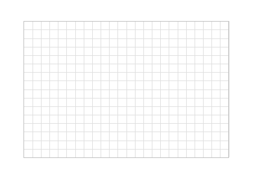

# Printable Graph Paper

Download elegant digital graph papers in various sizes.
The light gray grid of square cells creates orientation on the sheet for writing and drawing without being dominant.
Handwriting note-taking programs (for example, [Xournal++](https://github.com/xournalpp/xournalpp/)) can straightway annotate all PDFs.
After or without annotation, every standard printer can print them.
Concretely, the grid is printable with black ink only and leaves sufficient margins for the edges of the page.

<kbd></kbd>

## PDF Download

Please find your preferred format in the following lists.
The repo provides each format in two variants that only differ in rotation: portrait (taller than wide, like a door standing, the more used orientation) and landscape (wider than tall, like a door laying on its side, useful for wide pictures or tables).
If unsure, use the files from your region marked with a :star:.

### European Formats (ISO 216 Standard)

* [A0 Format Portrait](https://github.com/bithappens/printable-graph-paper/releases/latest/download/a0paper-portrait.pdf) :black_small_square: [A0 Format Landscape](https://github.com/bithappens/printable-graph-paper/releases/latest/download/a0paper-landscape.pdf)
* [A1 Format Portrait](https://github.com/bithappens/printable-graph-paper/releases/latest/download/a1paper-portrait.pdf) :black_small_square: [A1 Format Landscape](https://github.com/bithappens/printable-graph-paper/releases/latest/download/a1paper-landscape.pdf)
* [A2 Format Portrait](https://github.com/bithappens/printable-graph-paper/releases/latest/download/a2paper-portrait.pdf) :black_small_square: [A2 Format Landscape](https://github.com/bithappens/printable-graph-paper/releases/latest/download/a2paper-landscape.pdf)
* [A3 Format Portrait](https://github.com/bithappens/printable-graph-paper/releases/latest/download/a3paper-portrait.pdf) :black_small_square: [A3 Format Landscape](https://github.com/bithappens/printable-graph-paper/releases/latest/download/a3paper-landscape.pdf)
* [A4 Format Portrait](https://github.com/bithappens/printable-graph-paper/releases/latest/download/a4paper-portrait.pdf) :star: [A4 Format Landscape](https://github.com/bithappens/printable-graph-paper/releases/latest/download/a4paper-landscape.pdf)
* [A5 Format Portrait](https://github.com/bithappens/printable-graph-paper/releases/latest/download/a5paper-portrait.pdf) :black_small_square: [A5 Format Landscape](https://github.com/bithappens/printable-graph-paper/releases/latest/download/a5paper-landscape.pdf)
* [A6 Format Portrait](https://github.com/bithappens/printable-graph-paper/releases/latest/download/a6paper-portrait.pdf) :black_small_square: [A6 Format Landscape](https://github.com/bithappens/printable-graph-paper/releases/latest/download/a6paper-landscape.pdf)
* [B0 Format Portrait](https://github.com/bithappens/printable-graph-paper/releases/latest/download/b0paper-portrait.pdf) :black_small_square: [B0 Format Landscape](https://github.com/bithappens/printable-graph-paper/releases/latest/download/b0paper-landscape.pdf)
* [B1 Format Portrait](https://github.com/bithappens/printable-graph-paper/releases/latest/download/b1paper-portrait.pdf) :black_small_square: [B1 Format Landscape](https://github.com/bithappens/printable-graph-paper/releases/latest/download/b1paper-landscape.pdf)
* [B2 Format Portrait](https://github.com/bithappens/printable-graph-paper/releases/latest/download/b2paper-portrait.pdf) :black_small_square: [B2 Format Landscape](https://github.com/bithappens/printable-graph-paper/releases/latest/download/b2paper-landscape.pdf)
* [B3 Format Portrait](https://github.com/bithappens/printable-graph-paper/releases/latest/download/b3paper-portrait.pdf) :black_small_square: [B3 Format Landscape](https://github.com/bithappens/printable-graph-paper/releases/latest/download/b3paper-landscape.pdf)
* [B4 Format Portrait](https://github.com/bithappens/printable-graph-paper/releases/latest/download/b4paper-portrait.pdf) :black_small_square: [B4 Format Landscape](https://github.com/bithappens/printable-graph-paper/releases/latest/download/b4paper-landscape.pdf)
* [B5 Format Portrait](https://github.com/bithappens/printable-graph-paper/releases/latest/download/b5paper-portrait.pdf) :black_small_square: [B5 Format Landscape](https://github.com/bithappens/printable-graph-paper/releases/latest/download/b5paper-landscape.pdf)
* [B6 Format Portrait](https://github.com/bithappens/printable-graph-paper/releases/latest/download/b6paper-portrait.pdf) :black_small_square: [B6 Format Landscape](https://github.com/bithappens/printable-graph-paper/releases/latest/download/b6paper-landscape.pdf)

### North American Formats (ANSI Standard)

* [Legal Format Portrait](https://github.com/bithappens/printable-graph-paper/releases/latest/download/legalpaper-portrait.pdf) :black_small_square: [Legal Format Landscape](https://github.com/bithappens/printable-graph-paper/releases/latest/download/legalpaper-landscape.pdf)
* [Letter Format Portrait](https://github.com/bithappens/printable-graph-paper/releases/latest/download/letterpaper-portrait.pdf) :star: [Letter Format Landscape](https://github.com/bithappens/printable-graph-paper/releases/latest/download/letterpaper-landscape.pdf)

### Japanese Formats (JIS Standard)

* [B0J Format Portrait](https://github.com/bithappens/printable-graph-paper/releases/latest/download/b0jpaper-portrait.pdf) :black_small_square: [B0J Format Landscape](https://github.com/bithappens/printable-graph-paper/releases/latest/download/b0jpaper-landscape.pdf)
* [B2J Format Portrait](https://github.com/bithappens/printable-graph-paper/releases/latest/download/b2jpaper-portrait.pdf) :black_small_square: [B2J Format Landscape](https://github.com/bithappens/printable-graph-paper/releases/latest/download/b2jpaper-landscape.pdf)
* [B3J Format Portrait](https://github.com/bithappens/printable-graph-paper/releases/latest/download/b3jpaper-portrait.pdf) :black_small_square: [B3J Format Landscape](https://github.com/bithappens/printable-graph-paper/releases/latest/download/b3jpaper-landscape.pdf)
* [B4J Format Portrait](https://github.com/bithappens/printable-graph-paper/releases/latest/download/b4jpaper-portrait.pdf) :star: [B4J Format Landscape](https://github.com/bithappens/printable-graph-paper/releases/latest/download/b4jpaper-landscape.pdf)
* [B5J Format Portrait](https://github.com/bithappens/printable-graph-paper/releases/latest/download/b5jpaper-portrait.pdf) :black_small_square: [B5J Format Landscape](https://github.com/bithappens/printable-graph-paper/releases/latest/download/b5jpaper-landscape.pdf)
* [B6J Format Portrait](https://github.com/bithappens/printable-graph-paper/releases/latest/download/b6jpaper-portrait.pdf) :black_small_square: [B6J Format Landscape](https://github.com/bithappens/printable-graph-paper/releases/latest/download/b6jpaper-landscape.pdf)

### Screen Formats

* [16:9 Screen Beamer](https://github.com/bithappens/printable-graph-paper/releases/latest/download/beamer169.pdf) :star:
* [4:3 Screen Beamer](https://github.com/bithappens/printable-graph-paper/releases/latest/download/beamer43.pdf)

## Design Decisions

The design of the graph papers aims for maximal flexibility and universal usage.
This repo provides PDFs for most of the [standardized paper sizes](https://en.wikipedia.org/wiki/Paper_size) and always shows only complete grid cells without any half cells at the edges.
Every modern printer can print these PDFs as they feature a sufficient margin and use only gray colors.
Printed papers are suitable for binders as all graph grids leave enough margin to comply with the [hole punch standards](https://en.wikipedia.org/wiki/Hole_punch#Standards).
Depending on the paper format, the punched holes slightly touch and interleave with the edge of the graph grid for maximum usable space while avoiding overlap with any annotation (and thereby its loss through the punched holes)

## Contributing

I am always looking for new ideas, feedback, and all other forms of non-code contributions.
At the moment, I am particularly interested in missing paper formats and potential problems during usage.
Please just [create an issue](https://github.com/bithappens/printable-graph-paper/issues) about your thoughts.
Especially create an issue when you want to contribute code and before you open a pull request.
